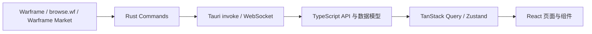

<p style="text-align: center;">
  
</p>

<h1 style="text-align: center;">DoroFrame</h1>

<p style="text-align: center;">
  一个聚合 Warframe 世界状态与 Warframe Market 数据的跨平台桌面伴侣。
</p>

<p style="text-align: center;">
  <a href="https://github.com/Yawanaika/doroframe/releases/latest"></a>
  <a href="LICENSE"></a>
</p>

DoroFrame 使用 Tauri 2、React 19 和 TypeScript 构建。它将常用的世界状态、地区轮换、奖励信息和市场交易功能集中在一个桌面应用中，减少玩家在游戏、Wiki 与交易网站之间来回切换的成本。

> DoroFrame 是社区开发的第三方工具，与 Digital Extremes 或 Warframe Market 官方无隶属关系。

## 功能

### 世界状态

- 聚合希图斯、福尔图娜、魔胎之境、扎里曼、圣所和六人组等地区赏金与轮换。
- 展示仲裁、每日突击、执刑官猎杀、钢铁侵袭和科研任务。
- 展示警报、虚空裂缝、虚空风暴、入侵与限时活动。
- 展示虚空商人、Prime 宝库、Darvo 每日特惠和每周氏族宝库奖励。
- 展示午夜电波、无尽回廊、1999 日历和沉沦之地等长期内容。
- 提供倒计时、节点、阵营、任务类型和本地化奖励名称。

### Warframe Market

- 搜索物品并查看买入、卖出订单和套装信息。
- 创建、编辑、关闭和删除自己的市场订单。
- 搜索紫卡、玄骸和帕尔沃斯的姐妹拍卖。
- 创建和管理拍卖，并通过 WebSocket 接收实时竞价更新。
- 查看个人资料、订单、拍卖及参与的竞拍。
- 按杜卡德/白金比值和成交量比较 Prime 部件兑换效率。

### 桌面体验

- 支持中文和英文界面及 Warframe 数据字典。
- 支持浅色、深色、跟随系统以及多套可组合颜色主题。
- 支持调整世界状态自动刷新间隔。
- 支持应用内检查、下载并安装新版本。
- 使用 Hash 路由保留物品深链接和页面刷新状态。

## 下载

从 [GitHub Releases](https://github.com/Yawanaika/doroframe/releases/latest) 下载最新版本。

当前自动发布流程提供：

| 平台    | 架构          | 发布状态 |
|---------|---------------|----------|
| Windows | x86_64        | 自动构建 |
| macOS   | Apple Silicon | 自动构建 |

其他 Tauri 支持的平台可按照下方开发说明自行构建。

## 开发环境

开始之前，请安装：

- [Node.js 22](https://nodejs.org/)
- [pnpm 11](https://pnpm.io/installation)
- [Rust stable](https://www.rust-lang.org/tools/install)
- [Tauri 2 系统依赖](https://v2.tauri.app/start/prerequisites/)

克隆并安装依赖：

```bash
git clone https://github.com/Yawanaika/doroframe.git
cd doroframe
pnpm install --frozen-lockfile
```

启动完整桌面开发环境：

```bash
pnpm start
```

该命令会同时启动 Vite 开发服务器和 Tauri 桌面窗口。首次运行需要编译 Rust 依赖，耗时会比后续启动更长。

只启动浏览器端界面：

```bash
pnpm dev
```

纯浏览器模式适合调试布局和组件，但依赖 Tauri Command 的世界状态、市场请求、账号和自动更新功能不可完整使用。

## 常用命令

| 命令                   | 用途                           |
|------------------------|--------------------------------|
| `pnpm start`           | 启动 Tauri 桌面开发环境        |
| `pnpm dev`             | 仅启动 Vite 前端开发服务器     |
| `pnpm build`           | 执行 TypeScript 检查并构建前端 |
| `pnpm tauri build`     | 构建当前平台的桌面安装包       |
| `pnpm test`            | 以监听模式运行 Vitest          |
| `pnpm exec vitest run` | 单次运行全部测试               |
| `pnpm test:release`    | 测试版本发布脚本               |
| `pnpm test:changelog`  | 测试变更日志生成器             |

## 技术栈

| 层级       | 技术                                                              |
|------------|-------------------------------------------------------------------|
| 桌面运行时 | Tauri 2、Rust、Tokio、Reqwest                                     |
| 前端       | React 19、TypeScript、Vite                                        |
| UI         | Tailwind CSS 4、Base UI、Radix UI、Lucide                         |
| 路由与数据 | TanStack Router、TanStack Query、TanStack Table、TanStack Virtual |
| 状态管理   | Zustand、Tauri Store                                              |
| 国际化     | i18next、warframe-public-export-plus                              |
| 测试       | Vitest、Testing Library、jsdom                                    |

## 数据流

核心世界状态与市场 API 请求通过 Rust 后端发出。前端 API 层调用 Tauri Command，随后将原始 JSON 解析成业务模型，再由 TanStack Query 缓存和分发给页面组件；图片与补充字典等静态资源由前端按需加载。



世界状态与部分浏览数据带有短时缓存；市场拍卖的竞价更新通过 WebSocket 推送。

## 项目结构

```text
doroframe/
├── public/                    # 静态图片与中英文本地化字典
├── src/
│   ├── api/                   # 前端 Tauri Command 调用边界
│   ├── app/                   # 路由与应用布局
│   ├── components/            # 通用组件与基础 UI
│   ├── features/
│   │   ├── market/            # 市场订单、拍卖、杜卡德和 WebSocket
│   │   ├── updater/           # 桌面自动更新
│   │   └── world/             # 世界状态查询与展示组件
│   ├── hooks/                 # 倒计时、地区循环等通用 Hook
│   ├── lib/                   # i18n、查询客户端、WPEP 与工具函数
│   ├── routes/                # 页面级组件
│   ├── store/                 # 设置、认证和更新状态
│   ├── tests/                 # 单元测试与组件测试
│   ├── themes/                # 基础色、主色和图表主题
│   └── types/                 # World State 与 Market 数据模型
├── src-tauri/
│   ├── src/commands/          # Rust HTTP、认证和 WebSocket 命令
│   └── tauri.conf.json        # 窗口、打包与更新配置
├── docs/                      # Warframe Market API 与模型文档
├── tools/                     # 发布脚本
└── .github/workflows/         # 发布与数据依赖自动更新
```

## 数据来源

| 来源                                                                                     | 用途                                 |
|------------------------------------------------------------------------------------------|--------------------------------------|
| [Warframe World State](https://api.warframe.com/cdn/worldState.php)                      | 官方世界状态                         |
| [browse.wf](https://browse.wf/)                                                          | 仲裁、赏金轮换、钢铁侵袭和补充字典   |
| [Warframe Market](https://warframe.market/)                                              | 市场物品、订单、拍卖、账号与实时竞价 |
| [warframe-public-export-plus](https://www.npmjs.com/package/warframe-public-export-plus) | 物品、节点、奖励、图标和多语言数据   |

应用需要联网才能刷新实时数据。外部服务不可用或触发限流时，对应模块可能暂时无法加载。

## 测试与提交前检查

提交代码前至少运行：

```bash
pnpm exec vitest run
pnpm build
```

修改 Rust 后端时，再运行：

```bash
cargo check --manifest-path src-tauri/Cargo.toml
```

新增世界状态字段时，通常需要同步修改：

1. `src/types/wf-state/` 中的数据模型和 JSON 解析。
2. `src/features/world/queries.ts` 中的查询选择器。
3. `src/features/world/components/` 中的展示组件。
4. `src/routes/` 中对应页面入口。
5. `public/lang/` 中的中英文文案。
6. `src/tests/types/world/` 中的解析测试。

## 贡献

欢迎提交 Issue 和 Pull Request。
请让改动保持单一目的，并为数据解析、状态逻辑或接口行为补充相应测试。

## 许可证

本项目使用 [GNU General Public License v3.0](LICENSE) 发布。
